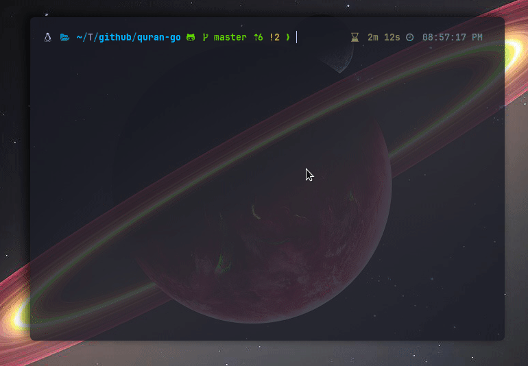

# QIT - Quran In Terminal

    

A Simple TUI application to show the holy Quran in terminal for lazy people.

    

This application is built-with the really nice TUI package : [Bubbletea](https://github.com/charmbracelet/bubbletea)

## TODO
The application is in very early stage of development, with messy code and many copy-paste code from docs and other repos lol.

- [X] Add Double Pane (book-like) ~~Check [this out](https://github.com/treilik/bubbleboxer)~~
- [X] Toggle between panes
- [X] ~~Optimize the page search by sorting~~ Throw a [hashmap](https://preview.redd.it/u0x6znp3q5x41.jpg?auto=webp&s=744deb8e8fbde68933f1789976b765e409d97743)
- [X] Re-Organize the `tea` (The Elm Architecture)
- [X] Add themes :D
- [ ] Add more page info to the page title : `surah's name`
- [ ] Select Ayah and add to bookmark
- [ ] Search Ayah
- [ ] Highlight Ayah
- [ ] Fix Arabic text not displaying right.

## Fonts
A list of the most suitable fonts that displays the AR version in the terminal (kinda).
- Liberation font
- Inconsolate (semi expanded medium) font
- Consolas (Regular)
- SimSun Regular
- Fantasque Sans Mono Regular
