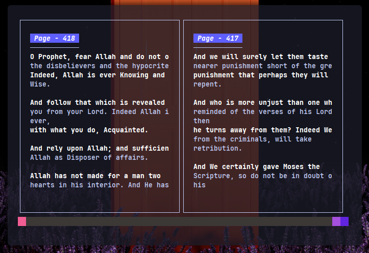

# QIT - Quran In Terminal

    

A Simple TUI application to show the holy Quran in terminal for lazy people.

    

This application is built-with the really nice TUI package : [Bubbletea](https://github.com/charmbracelet/bubbletea)

## TODO
The application is in very early stage of development, with messy code and many copy-paste code from docs lol.

- [X] Add Double Pane (book-like)
- [ ] Optimize the page search by sorting
- [X] Re-Organize the `tea` (The Elm Architecture)
- [X] Add themes :D
- [ ] Select Ayah and add to bookmark
- [ ] Search Ayah
- [ ] Highlight Ayah
- [ ] Fix Arabic text not displaying right.

